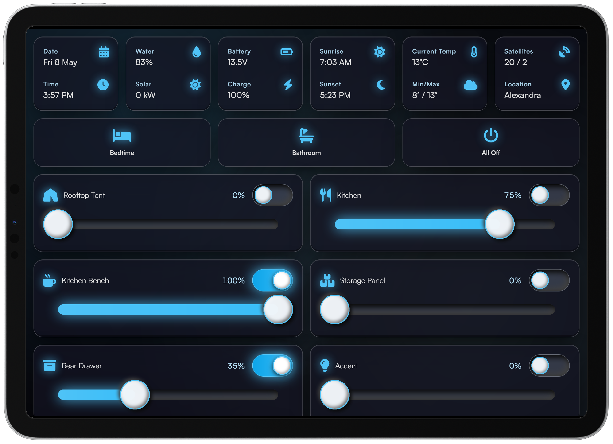
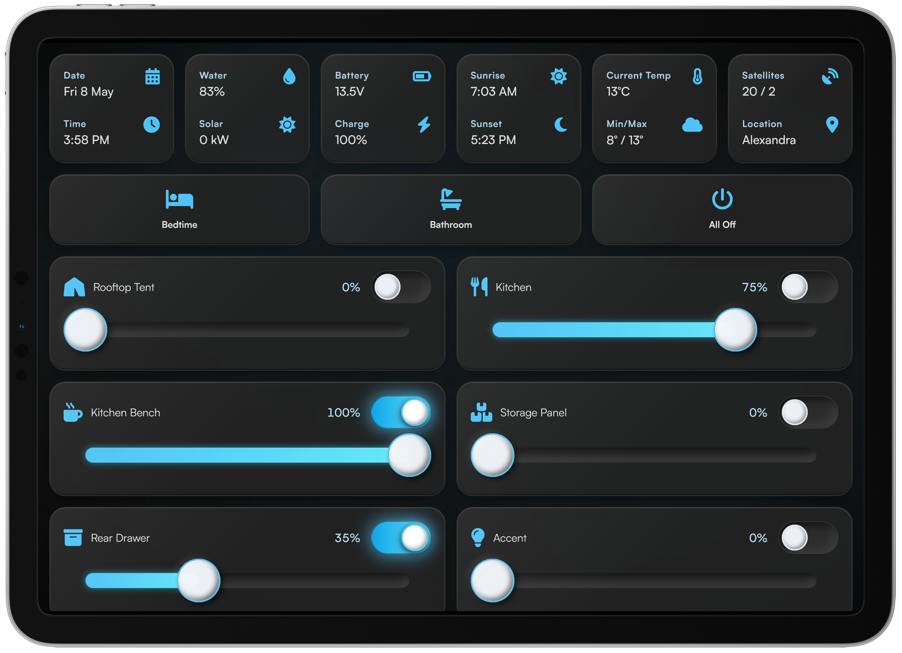
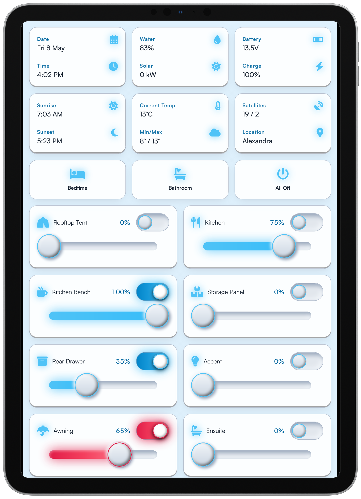
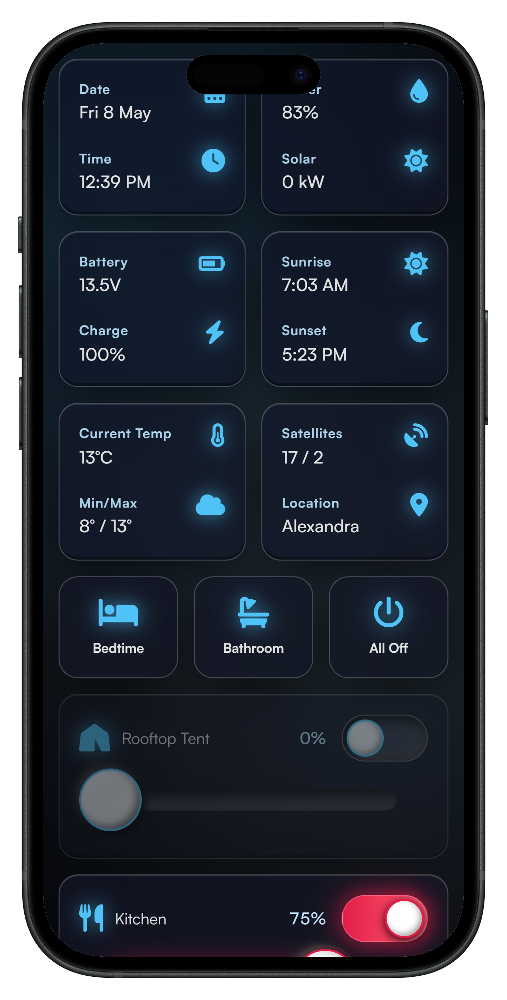
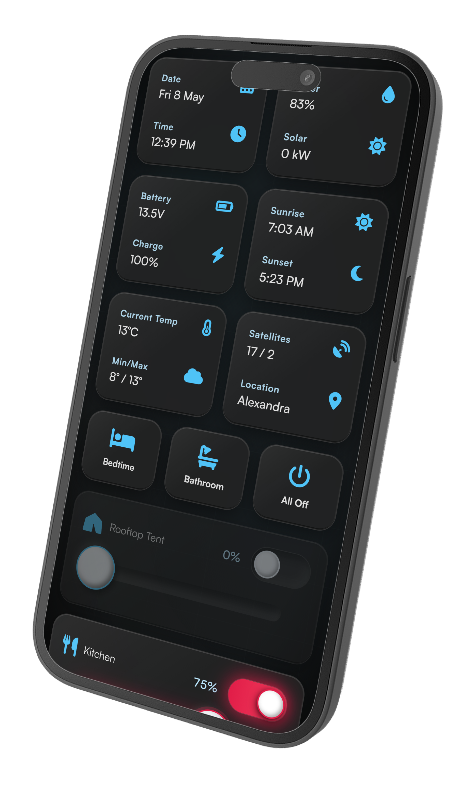
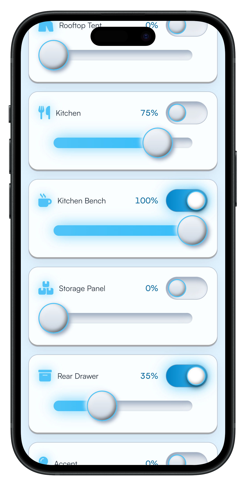
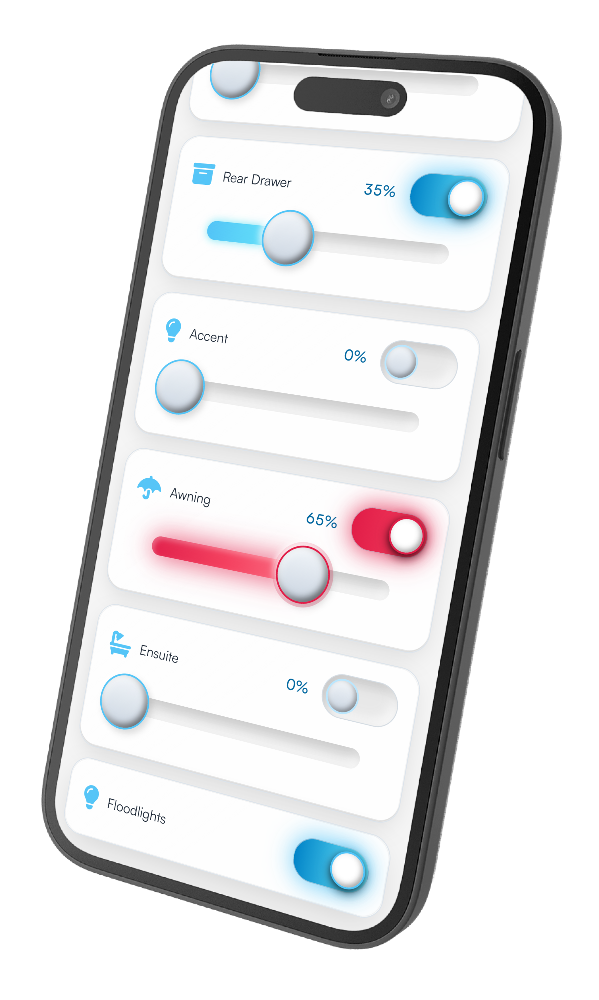

# The Pissmole Camper Control System

## Overview
The Pissmole Camping Control System (PCCS) is a Raspberry Pi-based control system for managing RV/camper trailer lighting and environmental data. It provides:
- Control of dimmable lighting and on/off relays
- Swapping between white and red (anti-bug) modes for kitchen and awning lights
- Lighting scenes such as bedtime, bathroom and all off
- Time-of-day phase calculation (day, evening and night) and accurate sunset/sunrise times based on GPS derived co-ordinates
- Reed switch monitoring of panel doors that switch on linked lights to levels based on time-of-day/phase
- Ambient lighting such as accent and awning that turn on whenever any panel is open
- Protection against turning on the rooftop tent lights when closed where the LED strip may be pressed against bedding
- Comprehensive logging that shows what light turned on and what activated it (phase change, scene, reed, user interface etc.)
- A flexible & scalable UI that can be accessed from any device including touchscreens, tablets and phones
- Full support for Cloudflare Tunnels for if the Internet connection is behind cgnat (e.g. Starlink, hotspots)
- A toast/message popup system with helpful information when events happen like GPS fix acquired/lost and phase changes
- Modern UI themes with light/dark modes including Glassmorphism/Frosted Glass, Neumorphism, Deep Minimal/Stealth and automatic toggling of light and dark modes in the evening and morning
- A System tab with diagnostics, overrides, policy explain, and additional information

The PCCS measures and displays environmental data including:
- GPS derived data & time and sunset/sunrise times based on current coordinates
- Water tank level
- Current temperature and daily min/max weather forecasts for the current location
- GPS satellite/quality fix and scraping of closest suburb based on current co-ordinates with offline/no internet fallback for greater North-East Victoria in Australia
- Battery + solar via Victron SmartShunt + MPPT SmartSolar BLE (`victron_ble` library)

The PCCS provides a better glamping experience when installed alongside other RPI packages:
- Network address translation (NAT) and DHCP via DNSMASQ. Upstream internet can be provided by USB tethering, 5G modem or Starlink
- UniFi controller for UniFi WAPs
- Pi-hole for adblocking

## Hardware
**Backend**

This project has been built with support for:
- Raspberry Pi
- Arduino Mega 2560 and IRLZ234N mosfets to ramp LEDs and the analog input for measuring water tank level
- Adafruit Ultimate GPS Breakout PA1616S
- 4 channel 5VDC relay module
- DS18B20 1-wire Temperature Sensor
- fuel level sensor that scales from 240ohm (full) to 33ohm (empty)

**Power Monitoring (Victron)**
- Victron SmartShunt (battery voltage, current, SoC, time remaining, etc.)
- Victron SmartSolar MPPT (solar power, daily yield, charge state)
- Connected over Bluetooth Low Energy using the `victron_ble` Python library (passive "Instant Readout" advertisements — no constant connection required)
- Requires a **USB Bluetooth adapter** on the Pi (onboard Bluetooth is disabled for GPS UART — see [Victron BLE setup](#victron-ble-setup) below)
- Configure MAC address + 32-character advertisement key per device in `config/pccs.conf` `[victron]` (from VictronConnect → device → gear → Product info → Instant readout via Bluetooth). The VictronConnect mesh name is not used by PCCS.

**Frontend**

 A touchscreen such as a waveshare powered by another RPI or Rock Pi for more capability in handling the intensive graphics processing.

## User Interface
#### Touchscreen/iPad/Desktop
|Glassmorphism|
|:-----------:|
||
|Neumorphism|
||

#### Portrait and Light Mode (Red indicates bug mode capable lights)


#### Mobile
|Glassmorphism|Neumorphism|
|:-----------:|:---------:|
|||
|||

See /images folder for more examples.

## Wiring
#### Raspberry Pi
| Logical/BCM Pin | Physical Pin | Channel Type           | Description                               |
|:---------------:|:------------:|:-----------------------|:------------------------------------------|
| GPIO4           | 7            | 1-Wire Input           | DS18B20 Temperature Sensor                |
| GPIO8           | 24           | UART TX                | GPS Transmit                              |
| GPIO10          | 19           | UART RX                | GPS Receive                               |
| GPIO17          | 11           | Relay Module Channel 1 | Floodlights                               |
| GPIO18          | 12           | Relay Module Channel 2 | Future Water Circuit (Not in Use)         |
| GPIO22          | 15           | Relay Module Channel 3 | Future Lighting Circuit (Not in Use)      |
| GPIO27          | 13           | Relay Module Channel 4 | Future Fridge & Oven Circuit (Not in Use) |
| GPIO12          | 32           | Reed Input             | Kitchen Bench                             |
| GPIO23          | 16           | Reed Input             | Kitchen Panel                             |
| GPIO24          | 18           | Reed Input             | Storage Panel                             |
| GPIO25          | 22           | Reed Input             | Rear Drawer                               |
| GPIO26          | 37           | Reed Input             | Rooftop Tent                              |
| N/A             | N/A          | USB Port               | Arduino Mega                              |
| N/A             | N/A          | USB Port               | Bluetooth dongle (Victron BLE — see below) |

**Notes**
<small>
- 1-Wire needs to be enabled in raspi-config (see instructions below)
- Onboard Bluetooth is **disabled** (`dtoverlay=disable-bt`) so the UART is free for GPS — Victron BLE requires a **USB Bluetooth dongle** ([Victron BLE setup](#victron-ble-setup))
- 5V for peripherals (GPS/relay module etc.) not included in above table
</small>

#### Arduino Mega
**Outputs**
| Pin | Channel Type           | Description                            |
|:---:|:-----------------------|:---------------------------------------|
| 2  | PWM/Output             | Kitchen Panel RGBW LED Strip - White   |
| 3  | PWM/Output             | Kitchen Panel RGBW LED Strip - Red     |
| 4  | PWM/Output             | Kitchen Panel RGBW LED Strip - Green   |
| 5  | PWM/Output             | Kitchen Bench LED Strip                |
| 6  | PWM/Output             | Storage Panel LED Strip and Downlights |
| 7  | PWM/Output             | Rear drawer LED Strip                  |
| 8  | PWM/Output             | Accent LED Strips                      |
| 9  | PWM/Output             | Awning RGBW LED Strip - White          |
| 10 | PWM/Output             | Awning RGBW LED Strip - Red            |
| 11 | PWM/Output             | Awning RGBW LED Strip - Green          |
| 12 | PWM/Output             | Rooftop tent LED Strip                 |
| 13 | PWM/Output             | Ensuite tent LED Strip                 |

**Inputs**
| Pin | Channel Type           | Description                            |
|:---:|:-----------------------|:---------------------------------------|
| A1 | Analog Input           | Water Level Sensor Input               |

**Notes**
<small>
- Arduino Mega is used as RPI PWM/I2C servo driver expansion boards don't have enough power to drive the MOSFETs
- Breadboard circuitboard for MOSFETs and outgoing lighting circuit connections is required
- Some analog signal conditioning may still be needed for the water level sender on A1
- Blue channels of RGB lights not used in this project due to Arduino channel capacity (Green is used to soften the red)
</small>

### Other Recommended Hardware
- **USB Bluetooth dongle** (required for Victron SmartShunt / MPPT). The Pi's onboard Bluetooth is turned off at boot by `dtoverlay=disable-bt` so the GPS can use the UART — a USB adapter is the only way to get Bluetooth on the PCCS Pi. Any BLE 4.0+ dongle should work (USB Bluetooth 5.0 adapters are fine). Plug it directly into a Pi USB port if possible; avoid long or unpowered USB hubs if Victron devices are more than a few metres away.
- 12-48v PoE 5 port network switch for WAP, a wired connection to RPI and a wired connection to other lighting control touchscreens in the installation (e.g. kitchen, rooftop tent)
- Cel-Fi GO 4/5G booster

## Software Installation & Configuration
These instructions are based on the following settings:
```ini
RPI IP: 10.10.10.1
DHCP range: 10.10.10.50-10.10.10.200
Kitchen touchscreen (reserved): 10.10.10.10
Internet connection: USB hotspot or WiFi (for when system is in the workshop)
Network: Wired ethernet connection is connected to other devices (touchscreen RPI's, WAPS) in the installation and not bridged to the upstream internet connection
```

1.  Format an SD card with Debian Trixie 64-bit. Enable SSH during installation and edit all customisation options to suit.
2.  Before ejecting the SD card, open `config.txt` in the root of the boot partition on the host computer (the volume that appears when you insert the card — not a path on the running Pi).
3.  Add the following lines to the end of the file to enable GPS communication:

```ini
enable_uart=1
dtoverlay=disable-bt
dtparam=spi=on
```

`dtoverlay=disable-bt` turns off the Pi's **built-in** Bluetooth so the serial port can be used for GPS. Victron BLE still works via a **USB Bluetooth dongle** (see [Victron BLE setup](#victron-ble-setup)).

4.  Save and eject card, install into RPI and login via SSH using the account name and password set during image creation e.g. `ssh $USERNAME@192.168.0.78` (substitute your account name if you have not set `USERNAME` yet).

After your first SSH login (step 4), set the Linux account and install path for every bash snippet below:

```bash
export USERNAME=pi
export PCCS_HOME=/home/$USERNAME/pccs4
export SCREEN_USER=pi
export SCREEN_HOST=10.10.10.10
```

Change `USERNAME` if your PCCS Pi account name differs. `SCREEN_USER` and `SCREEN_HOST` must match the username and host in each `[screens]` entry in `config/pccs.conf` — see step 12.

5.  Set a static IP address for the wired ethernet port, modify details to suit:
```bash
export USERNAME=pi
export PCCS_HOME=/home/$USERNAME/pccs4

sudo nmcli connection modify "netplan-eth0" ipv4.addresses 10.10.10.1/24
sudo nmcli connection modify "netplan-eth0" ipv4.dns "1.1.1.1,1.0.0.1"
sudo nmcli connection modify "netplan-eth0" ipv4.method manual
sudo nmcli connection modify "netplan-eth0" connection.autoconnect yes
```
Reset connection for changes to take effect:
```bash
sudo nmcli connection down "netplan-eth0"
sudo nmcli connection up "netplan-eth0"
nmcli connection show "netplan-eth0"
```
The above assumes that the ethernet name is `netplan-eth0`, run `nmcli connection show` to confirm.

---
6.   Install dependencies:
```bash
sudo apt update && sudo apt upgrade -y
sudo apt install nginx samba samba-common-bin python3-venv python3-lgpio git network-manager dnsmasq usbmuxd libimobiledevice-utils ipheth-utils bluez -y
```

`usbmuxd`, `libimobiledevice-utils`, and `ipheth-utils` enable iPhone USB tethering (creates an interface such as `eth1`, `usb0`, or `enx...` when the phone is plugged in with Personal Hotspot enabled). The interface name depends on how the kernel enumerates it (especially if you already have an onboard Ethernet as eth0). `network-manager` is required for Wi‑Fi scan/connect in the System tab. `bluez` provides Bluetooth support for the USB dongle used for Victron BLE (usually pre-installed on Raspberry Pi OS, but listed here for completeness).

---
7.  Create project folder, navigate to it and setup permissions for `$USERNAME` and nginx:
```bash
mkdir -p "$PCCS_HOME"

cd "$PCCS_HOME"
sudo chown -R "$USERNAME":www-data "$PCCS_HOME"
sudo chmod -R 775 "$PCCS_HOME"
sudo find "$PCCS_HOME" -type d -exec chmod g+s {} \;
```

---
8.  **(Optional)** - Enable file sharing for ease of editing:

Append the Samba share (uses `$USERNAME` and `$PCCS_HOME`):
```bash
sudo tee -a /etc/samba/smb.conf > /dev/null <<EOF

[pccs4]
    path = $PCCS_HOME
    writable = yes
    browsable = yes
    public = no
    valid users = $USERNAME
    force group = www-data
    create mask = 0664
    force create mode = 0664
    directory mask = 0775
    force directory mode = 0775
    hide dot files = no
EOF
```
Set the password for the share:
```bash
sudo smbpasswd -a "$USERNAME"
```
Restart samba for changes to take effect:
```bash
sudo systemctl restart smbd nmbd
```
Access the share via the IP set in the network configuration earlier in this guide. Use username `$USERNAME` and the password set just now to browse the shares.

---
9.  Configure nginx:
```bash
sudo tee /etc/nginx/sites-available/pccs > /dev/null <<EOF
server {
    listen 80;
    server_name _;

    root $PCCS_HOME;

    location / {
        proxy_pass http://127.0.0.1:5000;
        proxy_http_version 1.1;
        proxy_set_header Upgrade \$http_upgrade;
        proxy_set_header Connection "upgrade";
        proxy_set_header Host \$host;
        proxy_set_header X-Real-IP \$remote_addr;
        proxy_set_header X-Forwarded-For \$proxy_add_x_forwarded_for;
        proxy_set_header X-Forwarded-Proto \$scheme;
        proxy_read_timeout 86400;
        proxy_send_timeout 86400;
        proxy_buffering off;
    }

    location /static/ {
        alias $PCCS_HOME/static/;
        expires 30d;
        add_header Cache-Control "public";
        try_files \$uri =404;
    }
}
EOF
```

Create a symlink, remove the default site config and restart nginx for changes to take effect:
```bash
sudo ln -s /etc/nginx/sites-available/pccs /etc/nginx/sites-enabled/
sudo rm -f /etc/nginx/sites-enabled/default
sudo nginx -t
sudo systemctl restart nginx
```

---
10. Install Git, clone the project, install the virtual environment (venv) and install more dependencies:
```bash
git clone https://github.com/muntedpissmole/pccs4.git "$PCCS_HOME"

cd "$PCCS_HOME"
python3 -m venv --system-site-packages venv
source venv/bin/activate
pip install --upgrade pip
pip install -r requirements.txt

# Some pip-installed console scripts (e.g. victron-ble) can end up without the
# executable bit on Raspberry Pi OS venvs; make them runnable for the test
# commands below.
chmod +x venv/bin/victron-ble
```

Python dependencies are pinned in `requirements.txt` (runtime) and `requirements-dev.txt` (adds `pytest` for the test suite).

System packages for iPhone USB tethering (installed via `apt` above, not pip):

```
usbmuxd
libimobiledevice-utils
ipheth-utils
```

Configure GPS communications:
```bash
sudo nano /boot/firmware/cmdline.txt
```
Search for and remove these lines: `console=serial0,115200` or `console=ttyAMA0,115200`.
Press Ctrl+S to save and then Ctrl+x to exit.

Configure GPS port permissions:
```bash
sudo usermod -a -G tty,dialout "$USERNAME"
sudo chown root:tty /dev/ttyAMA0
sudo chmod 660 /dev/ttyAMA0
```

Setup communication for the temperature sensor:
```bash
sudo raspi-config
```
Go to `Interface Options` → `Enable 1-Wire` → `Finish` and then reboot.

After reboot, verify the 1-Wire bus is active and find your sensor IDs:
```bash
ls /sys/bus/w1/devices/ | grep ^28
```
You should see one or more folders like `28-000000xxxxxx`. Use these exact values for `outside_temp_sensor`, `fridge_temp_sensor`, etc. in `config/pccs.conf`.

If nothing appears, double-check the dtoverlay in `/boot/firmware/config.txt` (it should have `dtoverlay=w1-gpio` or `dtoverlay=w1-gpio-pullup` after running raspi-config).

---
11. Install Arduino compiler and push sketch to Arduino:

Add Arduino compiler repo:
```bash
curl -fsSL https://raw.githubusercontent.com/arduino/arduino-cli/master/install.sh | BINDIR=/usr/local/bin sudo sh
```
Install the compiler and push the sketch (Arduino must be connected and powered on):
```bash
cd "$PCCS_HOME"
arduino-cli core install arduino:avr
arduino-cli compile --fqbn arduino:avr:mega --upload --port /dev/ttyACM0 arduino/
```

---
12. **(Optional)** Set up remote touchscreen Pis for PCCS screen wake/sleep over SSH.

Each screen needs a **fixed LAN address** that matches its `[screens]` entry in `config/pccs.conf` (e.g. kitchen → `10.10.10.10`). Touchscreens should use DHCP on eth0; PCCS reserves their IPs in dnsmasq.

**Reserve touchscreen IPs (on the PCCS Pi, after dnsmasq is running — see [NAT/Routing/Internet](#natroutinginternet) step 2):**

1. Find each screen's Ethernet MAC while it is on the LAN:

```bash
cat /var/lib/misc/dnsmasq.leases
# columns: expiry  MAC  current_ip  hostname  client_id
```

2. Add a `dhcp-host=` line per screen in `config/dnsmasq/50-pccs-screens.conf` in the PCCS repo:

```ini
# MAC from dnsmasq.leases, IP must match [screens] host in config/pccs.conf
dhcp-host=52:58:15:8a:56:f6,10.10.10.10,kitchen,infinite
```

Reserved addresses may sit **outside** the dynamic `dhcp-range` (e.g. `.10` while the pool starts at `.50`) — dnsmasq honours reservations first.

3. Install the reservations (see [Scripts](#scripts) — `install-dnsmasq-screens.sh`):

```bash
sudo "$PCCS_HOME/scripts/install-dnsmasq-screens.sh"
```

4. On the touchscreen Pi, renew DHCP (reboot, or `sudo nmcli device reapply eth0` / replug Ethernet). Confirm it receives the reserved address:

```bash
ip -4 addr show eth0
ping -c1 10.10.10.1
```

**Remote touchscreen setup** — configure each screen under `[screens]` in `config/pccs.conf` (host, username, `brightness_path`, phase dim levels, linked reed), then run `setup-screen.sh` once per panel (see [Scripts](#scripts)). Test from the **Screens** tile on the System tab.

```bash
export SCREEN_USER=joel   # must match [screens] username
export SCREEN_HOST=10.10.10.10
"$PCCS_HOME/scripts/setup-screen.sh"
```

Set `brightness_path` in `config/pccs.conf` to match the remote OS:

- **Armbian + KDE Plasma / Wayland** (e.g. ROCK 5C kitchen HDMI panel): `dbus:org.kde.ScreenBrightness:/org/kde/ScreenBrightness/display0` — use phase dim levels plus `blank_path` (see `[screens]` notes). List displays with `busctl --user tree org.kde.ScreenBrightness` on the remote.
- **Radxa OS / sysfs fb blank**: `/sys/class/graphics/fb0/blank`

See the notes under `[screens]` in `config/pccs.conf` if wake/sleep still fails.

---
13. Do another permissions refresh to eliminate any lingering access issues:
```bash
cd "$PCCS_HOME"
sudo chown -R "$USERNAME":www-data .
sudo chmod -R 775 .
sudo find . -type d -exec chmod g+s {} \;
sudo find . -type f -exec chmod 664 {} \;
```

---
### Victron BLE setup

If you use a Victron SmartShunt and/or MPPT SmartSolar, PCCS reads them via passive BLE advertisements (Instant Readout). This does **not** join the VictronConnect mesh — only Instant Readout must be enabled on each device, and the Pi must be within BLE range.

#### USB Bluetooth dongle (required)

GPS on the PCCS Pi uses the serial UART (`/dev/ttyAMA0`). Step 3 adds `dtoverlay=disable-bt`, which **permanently disables the Pi's built-in Bluetooth** on every boot so that UART is not shared with BT. You cannot use onboard Bluetooth and GPS at the same time — a **USB Bluetooth dongle** is required for Victron.

1. Plug a BLE-capable USB Bluetooth adapter into the Pi (any free USB port).
2. Confirm the OS sees it:

```bash
lsusb | grep -i bluetooth
hciconfig -a
```

You should see a Bluetooth entry from `lsusb` and an `hci0` interface with `Bus: USB` (not the disabled onboard controller).

3. Enable Bluetooth and bring the adapter up:

```bash
sudo systemctl enable --now bluetooth
sudo rfkill unblock bluetooth
sudo hciconfig hci0 up
bluetoothctl show
```

`bluetoothctl show` should report `Powered: yes`. If Bluetooth was **soft-blocked** (disabled in software by the OS, not a physical switch), `rfkill list` shows `Soft blocked: yes` under `hci0` and `hciconfig hci0 up` fails with an RF-kill error until you run `rfkill unblock bluetooth`.

If `hci0` is missing after plugging in the dongle, try another USB port or a different adapter — some very old Bluetooth 2.0-only dongles do not support BLE.

#### Victron device configuration

1. In **VictronConnect**, for each device (shunt and MPPT separately): device → gear → **Product info** → **Instant readout via Bluetooth** → **Show**. Note the MAC address and 32-character key.

2. Edit `config/pccs.conf` under `[victron]`:

```ini
[victron]
shunt_address = aa:bb:cc:dd:ee:ff
shunt_key     = 0123456789abcdef0123456789abcdef

mppt_address  = 11:22:33:44:55:66
mppt_key      = fedcba9876543210fedcba9876543210
```

3. Test reception before starting PCCS (from the project venv):

```bash
cd "$PCCS_HOME"
chmod +x venv/bin/victron-ble
source venv/bin/activate
victron-ble discover
victron-ble read aa:bb:cc:dd:ee:ff@0123456789abcdef0123456789abcdef
```

If `victron-ble: command not found` or `Permission denied`, the `chmod` above fixes it (a quirk that can happen with `--system-site-packages` venvs on Raspberry Pi OS).

`discover` lists nearby Victron devices broadcasting Instant Readout. `read` prints live values for one device (repeat with each MAC@key). Ctrl+C to stop.

4. After PCCS is running, confirm in the logs:

```bash
journalctl -u pccs4.service -f | grep -i victron
```

Look for `Victron BLE scanner active`. If data stays stale, re-check MAC/key, Instant Readout on the device, dongle range, and that Bluetooth is not rfkill-blocked.

---
14. Install the PCCS as a service and start it on RPI startup:
```bash
sudo tee "$PCCS_HOME.service" > /dev/null <<EOF
[Unit]
Description=The Pissmole Camper Control System
After=network.target nginx.service

[Service]
User=$USERNAME
Group=www-data
WorkingDirectory=$PCCS_HOME
ExecStart=$PCCS_HOME/venv/bin/python3 $PCCS_HOME/app.py
Restart=always
RestartSec=5
StandardOutput=journal
StandardError=journal
Environment=PYTHONUNBUFFERED=1
LimitNOFILE=65535

[Install]
WantedBy=multi-user.target
EOF
```
Create a symlink, reload the systemctl, enable and autostart the PCCS:
```bash
sudo systemctl link "$PCCS_HOME.service"
sudo systemctl daemon-reload
sudo systemctl enable pccs4.service
sudo systemctl start pccs4.service
sudo systemctl status pccs4.service
```

Allow the PCCS service user to run live Wi‑Fi scans and connections (see [Scripts](#scripts) — `install-networkmanager-perms.sh`):

```bash
sudo usermod -aG netdev "$USERNAME"
sudo "$PCCS_HOME/scripts/install-networkmanager-perms.sh"
sudo systemctl restart pccs4.service
```

On the **System** tab **Wi‑Fi** tile: tap a network to select it (highlight + password form if needed), then press **Connect** — tapping the network name alone does not connect.

Check the status with:
```bash
sudo systemctl status pccs4
```
To make sure it started without any errors. View the live logs with:
```bash
journalctl -u pccs4.service -f
```
Access the UI via the IP address e.g. `http://10.10.10.1` or via the Cloudflare tunnel once configured. Diagnostics and overrides are on the **System** tab.

Access the log files at `\\10.10.10.1\pccs4\logs`.

### Scripts

Utility scripts live in `scripts/`. Export `PCCS_HOME` before running them (see the env block at the start of [Software Installation](#software-installation--configuration)).

| Script | Run as | When |
|--------|--------|------|
| `setup-screen.sh` | `$USERNAME` (not sudo) | Once per remote touchscreen (install step 12) |
| `install-dnsmasq-screens.sh` | `sudo` | After editing `config/dnsmasq/50-pccs-screens.conf` |
| `install-networkmanager-perms.sh` | `sudo` | Install step 14; re-run after `config/polkit/` changes |

#### `setup-screen.sh`

Prepares a remote touchscreen Pi so PCCS can wake, dim, and blank it over SSH when the linked reed opens or closes.

1. Creates `~/.ssh/pccs_screen` (if missing) and adds a `Host` block to `~/.ssh/config`
2. Runs `ssh-copy-id` — prompts for the **touchscreen SSH password** once
3. Installs passwordless sudo on the touchscreen for framebuffer blanking (`/sys/class/graphics/fb0/blank`) — prompts for **touchscreen sudo** once

Safe to re-run: existing keys and SSH config entries are skipped; blank sudoers is overwritten with the same rule, not duplicated.

```bash
export SCREEN_USER=joel      # SSH user on the touchscreen ([screens] username)
export SCREEN_HOST=10.10.10.10
"$PCCS_HOME/scripts/setup-screen.sh"
```

| Option / env | Effect |
|--------------|--------|
| `--ssh-only` | SSH keys only |
| `--blank-only` | Blank permissions only (SSH must already work) |
| `SKIP_BLANK=1` | Skip framebuffer blank setup |
| `BLANK_PATH=...` | Override blank sysfs path (default `/sys/class/graphics/fb0/blank`) |
| `SCREEN_ALIAS=...` | SSH config alias (default `kitchen-screen`) |

Repeat with each panel's `SCREEN_USER` and `SCREEN_HOST`. The script verifies passwordless SSH at the end (same flags PCCS uses).

#### `install-dnsmasq-screens.sh`

Applies fixed DHCP reservations for touchscreen Pis from the repo into the running dnsmasq instance.

1. Copies `config/dnsmasq/50-pccs-screens.conf` → `/etc/dnsmasq.d/50-pccs-screens.conf`
2. Removes duplicate `dhcp-host=` lines for the same MAC from `/etc/dnsmasq.conf`
3. Clears stale leases in `/var/lib/misc/dnsmasq.leases` so reserved MACs pick up their fixed IP immediately
4. Validates config and restarts dnsmasq

Edit `dhcp-host=` lines in the repo file first (MAC must match `dnsmasq.leases`; IP must match `[screens] host` in `config/pccs.conf`), then:

```bash
sudo "$PCCS_HOME/scripts/install-dnsmasq-screens.sh"
```

Renew DHCP on each touchscreen after running (reboot or replug Ethernet).

#### `install-networkmanager-perms.sh`

Installs the polkit rule that lets the PCCS service user control Wi‑Fi without a desktop login session.

1. Copies `config/polkit/50-pccs-networkmanager.rules` → `/etc/polkit-1/rules.d/50-pccs-networkmanager.rules`
2. Grants `network-control`, Wi‑Fi scan, and connection-profile changes to members of the `netdev` group

The service user must also be in `netdev` (`sudo usermod -aG netdev "$USERNAME"`). Without this, the System tab Wi‑Fi tile may show cached scan results and connect attempts fail with *Not authorized to control networking*.

```bash
sudo usermod -aG netdev "$USERNAME"
sudo "$PCCS_HOME/scripts/install-networkmanager-perms.sh"
sudo systemctl restart pccs4.service
```

Safe to re-run on every update when `config/polkit/` changes.

### Updating the PCCS
1.  SSH into the Pi and git pull the newest version:
```bash
export USERNAME=pi
export PCCS_HOME=/home/$USERNAME/pccs4

cd "$PCCS_HOME"
git pull
source venv/bin/activate
pip install -r requirements.txt

# Ensure victron-ble (and any other entry-point scripts) are executable.
chmod +x venv/bin/victron-ble
```

Update the Pi OS at the same time:
```bash
sudo apt update && sudo apt upgrade -y
```

Re-run installers if their config changed (see [Scripts](#scripts)):
```bash
sudo "$PCCS_HOME/scripts/install-networkmanager-perms.sh"   # config/polkit/
sudo "$PCCS_HOME/scripts/install-dnsmasq-screens.sh"      # config/dnsmasq/
```

Reboot if asked, otherwise restart the PCCS service:
```bash
sudo systemctl restart pccs4
```

### Run Application Manually

Stop the service (if installed/running):
```bash
sudo systemctl stop pccs4.service
```
Navigate to project folder, start a virtual environment and the PCCS:
```bash
export USERNAME=pi
export PCCS_HOME=/home/$USERNAME/pccs4

cd "$PCCS_HOME"
source venv/bin/activate
python app.py
```

## Other Setup:
### NAT/Routing/Internet

**Note:** The main install (step 5) and WiFi features use NetworkManager (nmcli). Do **not** use the old `dhcpcd.conf` method — it conflicts with NetworkManager and the packages the project installs.

**Before you begin this section:**
- Connect your WAN (iPhone tether or WiFi). For iPhone USB tethering: `nmcli device connect eth1` (or the actual name from `nmcli device status`).
- Tether interfaces commonly appear as `eth1` (not `usb0`) when you already have a wired LAN as `eth0`. WAN will always be either WiFi (wlan0) or the iPhone tether.

1. Configure the LAN static IP (eth0) and upstream route priorities (metrics) using nmcli. Lower `route-metric` = higher priority for the default route (so tether is preferred over WiFi when both are available).

The eth0 static IP for the internal LAN is handled in the main install step 5. Verify or re-apply if needed:

```bash
nmcli connection show
nmcli connection modify "netplan-eth0" ipv4.addresses 10.10.10.1/24
nmcli connection modify "netplan-eth0" ipv4.method manual
nmcli connection modify "netplan-eth0" connection.autoconnect yes
nmcli connection down "netplan-eth0"
nmcli connection up "netplan-eth0"
```

Identify the actual tether interface (run this after plugging in the iPhone with hotspot on):

```bash
nmcli device status
ip -br link show | grep -E 'eth|usb'
```

To prefer iPhone USB tethering (eth1) over WiFi (wlan0):

```bash
# Get exact connection names
nmcli connection show

# Tether (use the real name, e.g. the connection on eth1)
nmcli connection modify "eth1" ipv4.route-metric 50   # or whatever the conn name is
nmcli connection modify "eth1" autoconnect yes

# WiFi fallback
nmcli connection modify "netplan-wlan0-YourSSID" ipv4.route-metric 200
nmcli connection modify "netplan-wlan0-YourSSID" autoconnect yes

# Reactivate
nmcli connection down "eth1" || true
nmcli connection up "eth1" || true
nmcli connection down "netplan-wlan0-YourSSID" || true
nmcli connection up "netplan-wlan0-YourSSID" || true
```

Check with `ip route show` — the default route should prefer the tether (lower metric) when both WANs are up.

2.  Configure dnsmasq as a DHCP server on the internal LAN only (it is installed as part of step 6). It must **only** listen on eth0.

Create `/etc/dnsmasq.conf` with the following (edit the `except-interface` lines to match your actual upstream interface names — typically `wlan0` and the tether name like `eth1`):
```ini
interface=eth0
bind-interfaces
except-interface=wlan0
except-interface=eth1   # your iPhone tether interface name

dhcp-range=10.10.10.50,10.10.10.200,255.255.255.0,12h

dhcp-option=3,10.10.10.1   # gateway (this Pi)
dhcp-option=6,10.10.10.1   # DNS (this Pi)
```

Then enable and start the service:
```bash
sudo systemctl enable --now dnsmasq
```

**Touchscreen DHCP reservations:** PCCS expects fixed IPs for remote screens (see main install step 12). Edit `dhcp-host=` lines in `config/dnsmasq/50-pccs-screens.conf` (do **not** duplicate them in `/etc/dnsmasq.conf`), then run `install-dnsmasq-screens.sh` (see [Scripts](#scripts)). Until you run it, touchscreens keep their old dynamic address (e.g. `.113`).

Confirm with `ip -4 addr show` on the panel and `cat /var/lib/misc/dnsmasq.leases` on the PCCS Pi — kitchen should show `10.10.10.10`.

If a panel still keeps the wrong address, check it is using **DHCP** on eth0 (not a static IP in NetworkManager) and that the Ethernet MAC in `dhcp-host=` matches `dnsmasq.leases`.


3. Enable IP forwarding (if not already done):
```bash
echo 'net.ipv4.ip_forward=1' | sudo tee /etc/sysctl.d/99-pccs-nat.conf
sudo sysctl -p /etc/sysctl.d/99-pccs-nat.conf
```

4. Install iptables tools and set up NAT/masquerading. WAN interfaces are `wlan0` (WiFi) and the tether (usually `eth1` for iPhone when eth0 is LAN).

First connect the tether if not already up:
```bash
nmcli device connect eth1   # or the actual tether device name from `nmcli device status`
```

Then apply the rules (adjust `eth1` if your tether interface has a different name):
```bash
sudo apt install -y iptables iptables-persistent
sudo iptables -t nat -F
sudo iptables -t filter -F
# Masquerade outbound from LAN to either WAN
sudo iptables -t nat -A POSTROUTING -o wlan0 -j MASQUERADE
sudo iptables -t nat -A POSTROUTING -o eth1 -j MASQUERADE
# Allow forwarding LAN <-> WANs
sudo iptables -A FORWARD -i eth0 -o wlan0 -j ACCEPT
sudo iptables -A FORWARD -i eth0 -o eth1 -j ACCEPT
sudo iptables -A FORWARD -i wlan0 -o eth0 -m state --state RELATED,ESTABLISHED -j ACCEPT
sudo iptables -A FORWARD -i eth1 -o eth0 -m state --state RELATED,ESTABLISHED -j ACCEPT
# Save so they survive reboot
sudo netfilter-persistent save
```

Verify NAT is active:
```bash
sudo iptables -t nat -L -v -n
ip route   # default route should prefer the tether (lower metric) when both WANs are up
```

Restart services:
```bash
sudo systemctl restart NetworkManager dnsmasq
```

Reboot the Pi:
```bash
sudo reboot
```

After reboot, test from a device on the eth0 LAN (the wired network):
```bash
ping 8.8.8.8
ping google.com
```

Check that DHCP is only on the wired LAN:
```bash
sudo ss -tulnnp | grep dnsmasq
ip addr show
ip route show
```

### UniFi OS Server
1.  Go to the [Unifi software download page](https://ui.com/download/software/unifi-os-server), right click the Linux arm64 download link and copy the link.

2.  Download the installer:
```bash
wget -O unifiosinstaller [PASTE THE COPIED LINK HERE]
```

3.  Install Podman (required by the UniFi OS Server installer):
```bash
sudo apt update
sudo apt install podman
```

4.  Make it executable and run the installer:
```bash
sudo chmod +x unifiosinstaller
sudo ./unifiosinstaller
```

5.	Give the server admin rights:
```bash
export USERNAME=pi
sudo usermod -aG uosserver "$USERNAME"
```

Access the UI on `https://10.10.10.1:11443`.
