# The Pissmole Camper Control System

## Overview

The Pissmole Camping Control System (PCCS) is a Raspberry Pi-based control system for managing RV/camper trailer lighting and environmental data.

**Lighting and control**
-   Control of dimmable lighting and on/off relays
-   Swapping between white and red (anti-bug) modes for kitchen and awning lights
-   Lighting scenes such as bedtime, bathroom and all off
-   Time-of-day phase calculation (day, evening and night) and accurate sunset/sunrise times based on GPS derived co-ordinates
-   Reed switch monitoring of panel doors that switch on linked lights to levels based on time-of-day/phase
-   Support for turning on/off touchscreen screens that are mounted behind reed-monitored panels doors to save battery and screen burn-in
-   Ambient lighting such as accent and awning that turn on whenever any panel is open
-   Protection against turning on the rooftop tent lights when closed where the LED strip may be pressed against bedding
-   Comprehensive logging that shows what light turned on and what activated it (phase change, scene, reed, user interface etc.)
-   A flexible & scalable UI that can be accessed from any device including touchscreens, tablets and phones
-   Full support for Cloudflare Tunnels for if the Internet connection is behind cgnat (e.g. Starlink, hotspots)
-   A toast/message popup system with helpful information when events happen like GPS fix acquired/lost and phase changes
-   Modern UI themes with light/dark modes (see examples below)
-   A diagnostics and settings page with extensive override controls and additional information

**Environmental data**

- GPS location, time, and sunrise/sunset from current coordinates
- Water tank level
- Temperature and daily min/max weather forecasts for the current location
- GPS fix quality and nearest suburb (offline fallback for north-east Victoria, Australia)
- Battery and solar via Victron SmartShunt and MPPT SmartSolar

The PCCS provides a better glamping experience when installed alongside other RPI packages:

- NAT and DHCP for upstream internet via USB/WiFi hotspot, 5G modem or Starlink
- UniFi controller for UniFi WAPs
- Pi-hole for ad blocking

---

## Hardware

### Backend

Built for:

- Raspberry Pi
- Arduino Mega 2560 and IRLZ44N MOSFETs for LED PWM and analog water tank level
- Adafruit Ultimate GPS Breakout PA1616S
- 4-channel 5 VDC relay module
- DS18B20 1-Wire temperature sensor
- Fuel level sensor that scales from 240ohm (full) to 33ohm (empty) for the water tanks
- Victron SmartShunt — battery voltage, current, SoC, time remaining, etc.
- Victron SmartSolar MPPT — solar power, daily yield, charge state

### Frontend

A Waveshare (or similar) touchscreen (kitchen touchscreen in this project) on a separate Raspberry Pi or Rock 5c board for better graphics handling.

### Other hardware

- USB Bluetooth dongle (required for Victron equipment). Onboard Bluetooth disabled so that the GPS can use the UART which is the same port the onboard Bluetooth uses
- 12–48 V PoE 5-port switch — WAP, PCCS, and wired touchscreens (e.g. kitchen, rooftop tent)
- Cel-Fi GO 4G/5G booster

---

## User interface

The UI runs on touchscreens, tablets, and phones. Red indicators mark bug-mode-capable lights.

<table>
  <tr>
    <td align="center">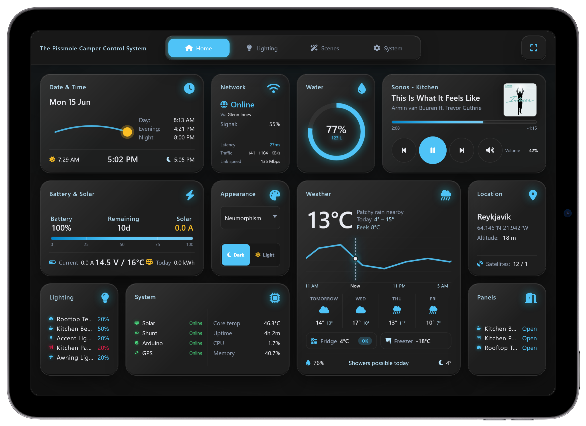</td>
  </tr>
  <tr>
    <td align="center"><strong>Neumorphism (Dark)</strong></td>
  </tr>
  <tr>
    <td align="center">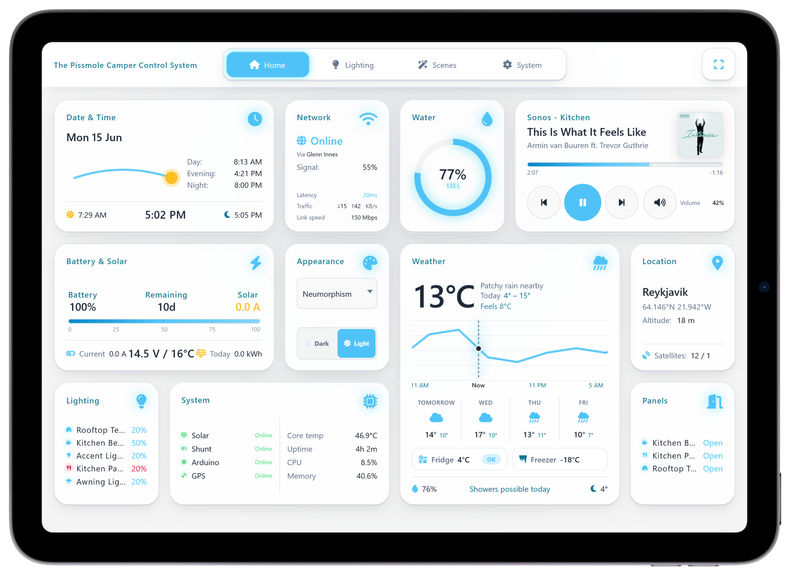</td>
  </tr>
  <tr>
    <td align="center"><strong>Neumorphism (Light)</strong></td>
  </tr>
  <tr>
    <td align="center">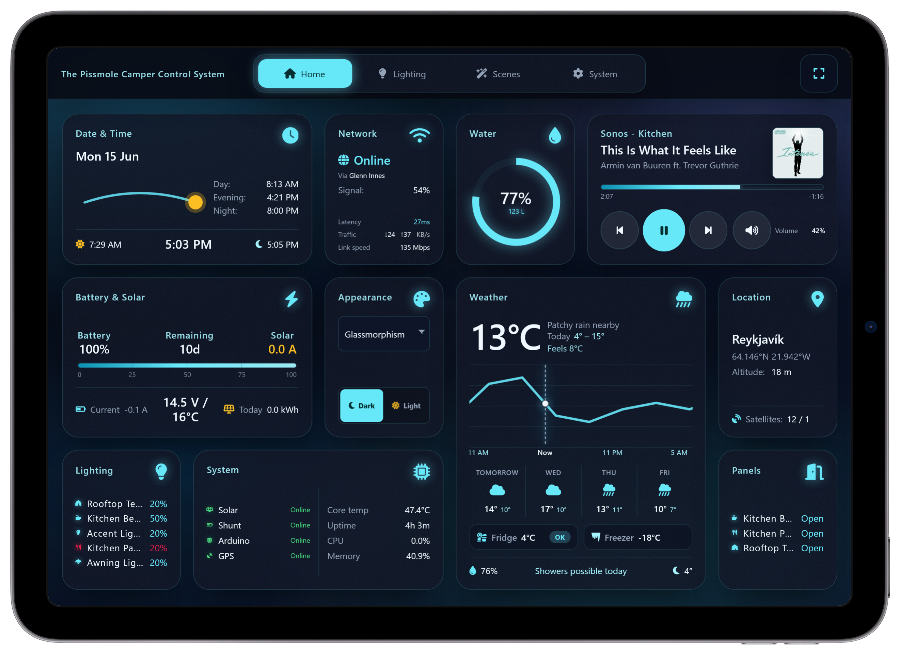</td>
  </tr>
  <tr>
    <td align="center"><strong>Glassmorphism (Dark)</strong></td>
  </tr>
  <tr>
    <td align="center">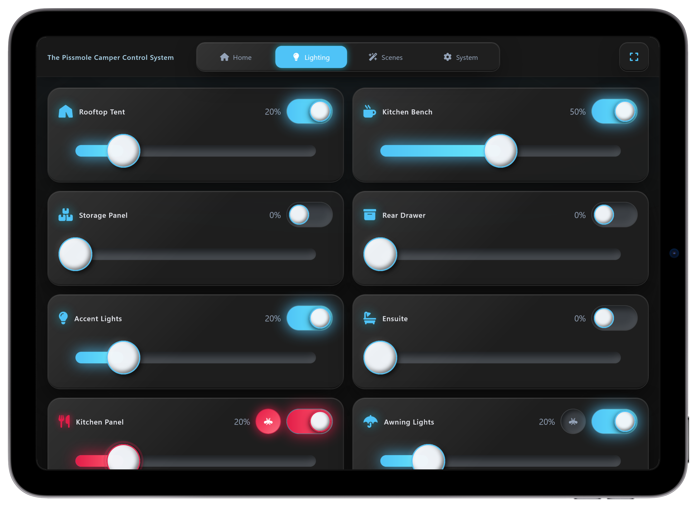</td>
  </tr>
  <tr>
    <td align="center"><strong>Glassmorphism (Dark) — Lighting</strong></td>
  </tr>
</table>

<table>
  <tr>
    <td align="center" width="50%">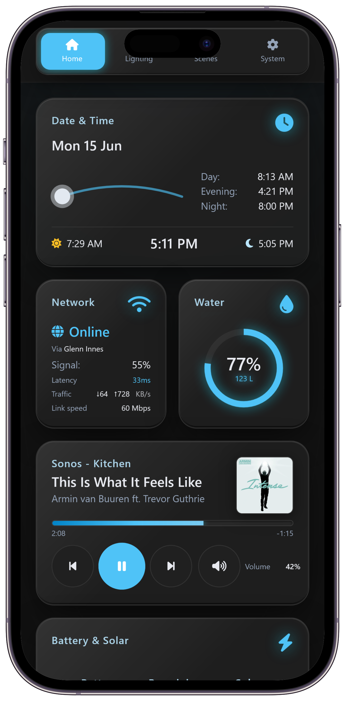</td>
    <td align="center" width="50%">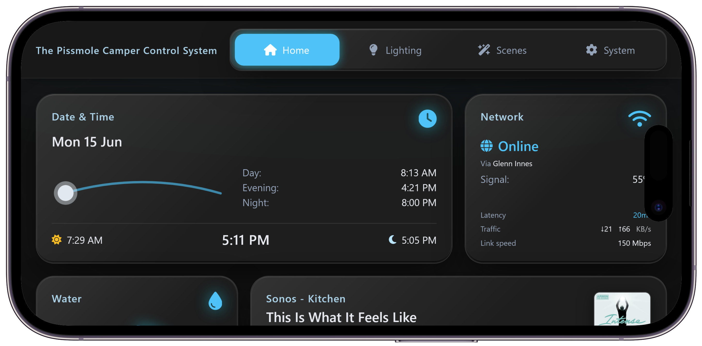</td>
  </tr>
  <tr>
    <td align="center"><strong>Neumorphism (Dark) — iPhone Portrait</strong></td>
    <td align="center"><strong>Neumorphism (Dark) — iPhone Landscape</strong></td>
  </tr>
</table>

### Additional themes

<table>
  <tr>
    <td align="center" width="50%">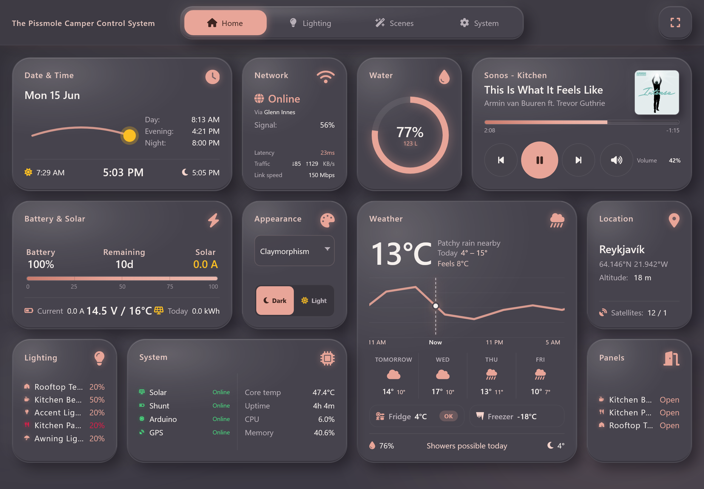</td>
    <td align="center" width="50%">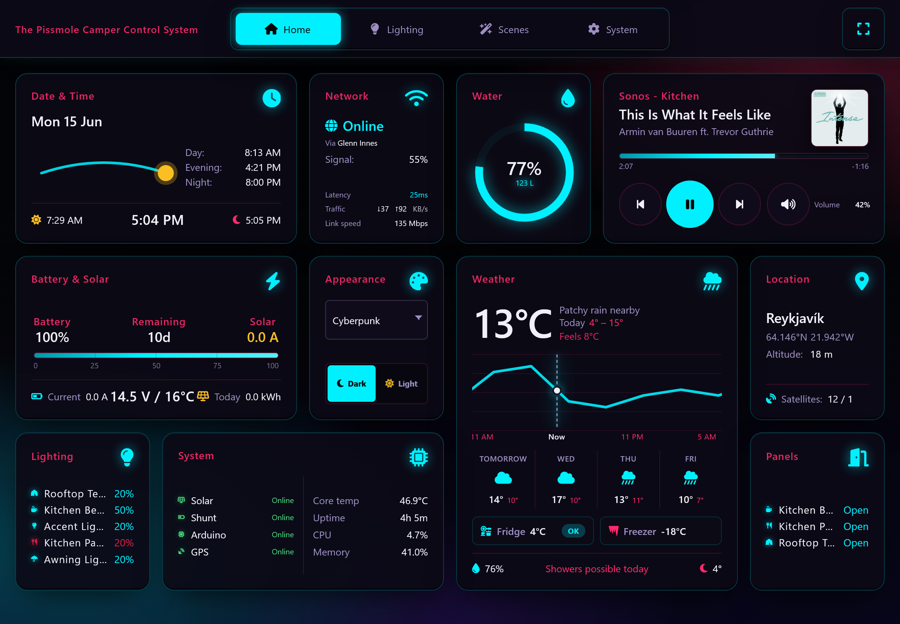</td>
  </tr>
  <tr>
    <td align="center"><strong>Claymorphism</strong> </td>
    <td align="center"><strong>Cyberpunk</strong> </td>
  </tr>
  <tr>
    <td align="center">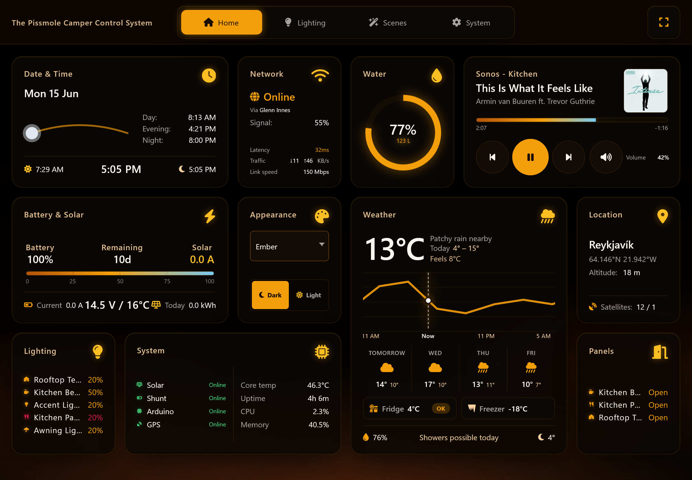</td>
    <td align="center">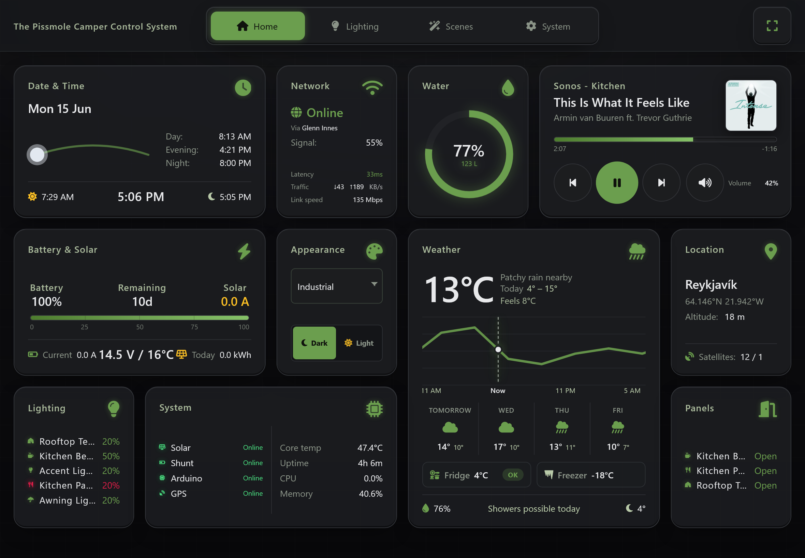</td>
  </tr>
  <tr>
    <td align="center"><strong>Ember</strong> </td>
    <td align="center"><strong>Industrial</strong> </td>
  </tr>
  <tr>
    <td align="center">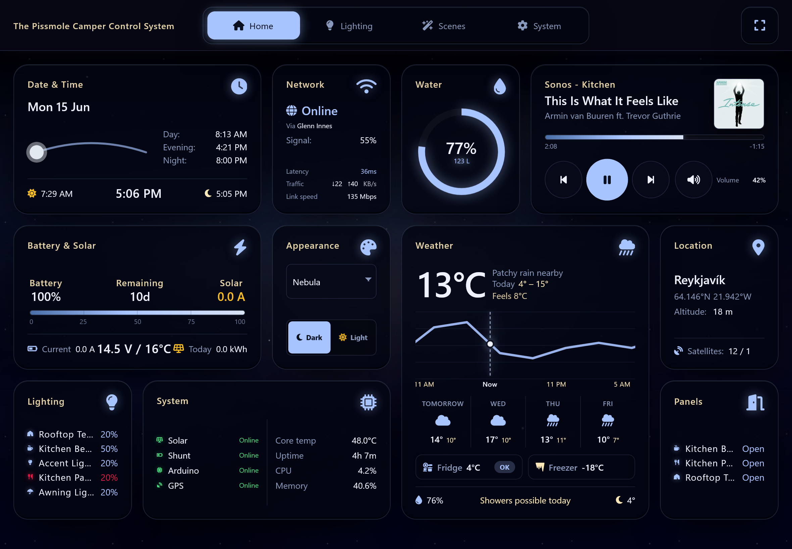</td>
    <td align="center">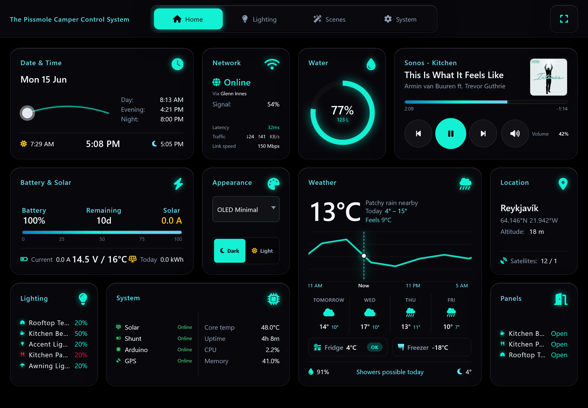</td>
  </tr>
  <tr>
    <td align="center"><strong>Nebula</strong> </td>
    <td align="center"><strong>OLED Minimal</strong> </td>
  </tr>
  <tr>
    <td align="center">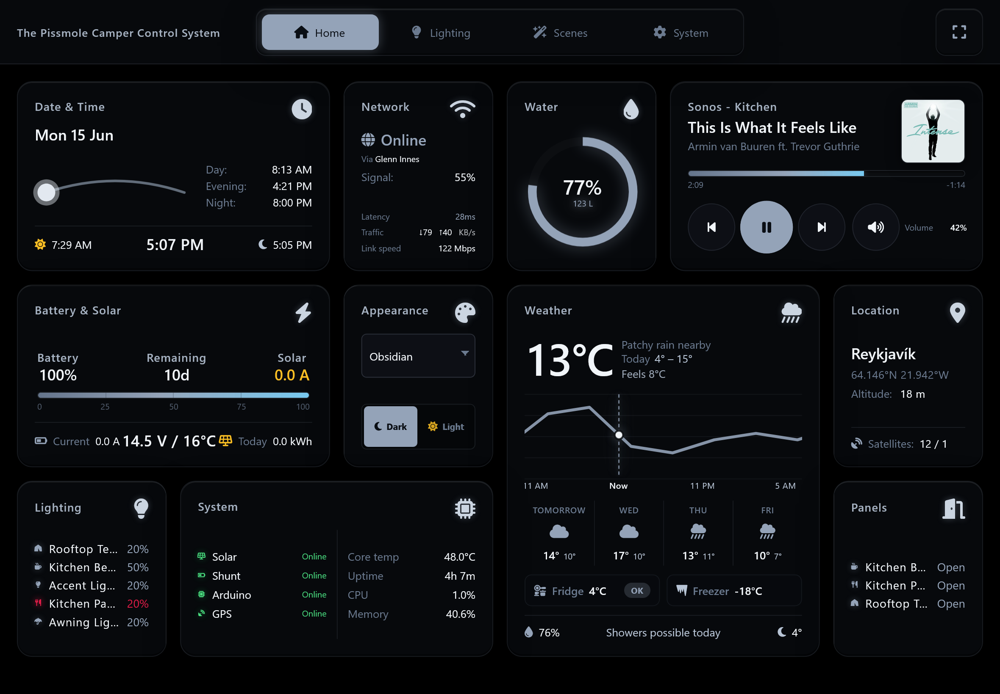</td>
    <td align="center">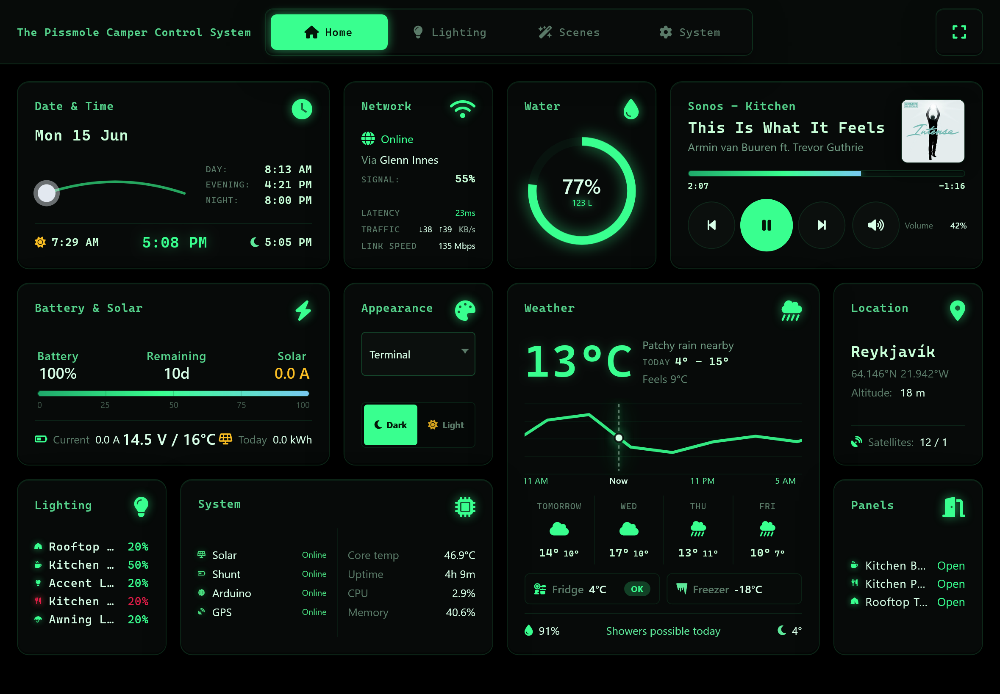</td>
  </tr>
  <tr>
    <td align="center"><strong>Obsidian</strong> </td>
    <td align="center"><strong>Terminal</strong> </td>
  </tr>
  <tr>
    <td align="center" colspan="2">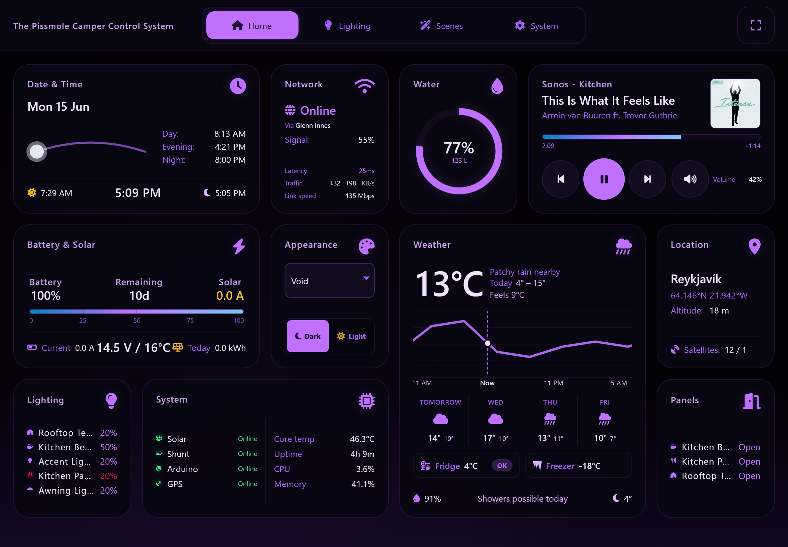</td>
  </tr>
  <tr>
    <td align="center" colspan="2"><strong>Void</strong> </td>
  </tr>
</table>

More examples in the [`/images`](images/) folder.

---

## Documentation

Wiring, installation, scripts, updates, and network setup are on the **[project wiki](https://github.com/muntedpissmole/pccs4/wiki)**.

| Topic | Wiki page |
|-------|-----------|
| Shopping list | [Shopping List](https://github.com/muntedpissmole/pccs4/wiki/Shopping-List) |
| Wiring | [Wiring](https://github.com/muntedpissmole/pccs4/wiki/Wiring) |
| Installation | [Installation](https://github.com/muntedpissmole/pccs4/wiki/Installation) |
| Victron setup | [Victron Setup](https://github.com/muntedpissmole/pccs4/wiki/Victron-Setup) |
| Scripts | [Scripts](https://github.com/muntedpissmole/pccs4/wiki/Scripts) |
| Updating | [Updating](https://github.com/muntedpissmole/pccs4/wiki/Updating) |
| Run manually | [Run Manually](https://github.com/muntedpissmole/pccs4/wiki/Run-Manually) |
| NAT and Internet | [NAT and Internet](https://github.com/muntedpissmole/pccs4/wiki/NAT-and-Internet) |
| UniFi OS Server | [UniFi OS Server](https://github.com/muntedpissmole/pccs4/wiki/UniFi-OS-Server) |

---

## License

Licensed under the [MIT License](LICENSE).
