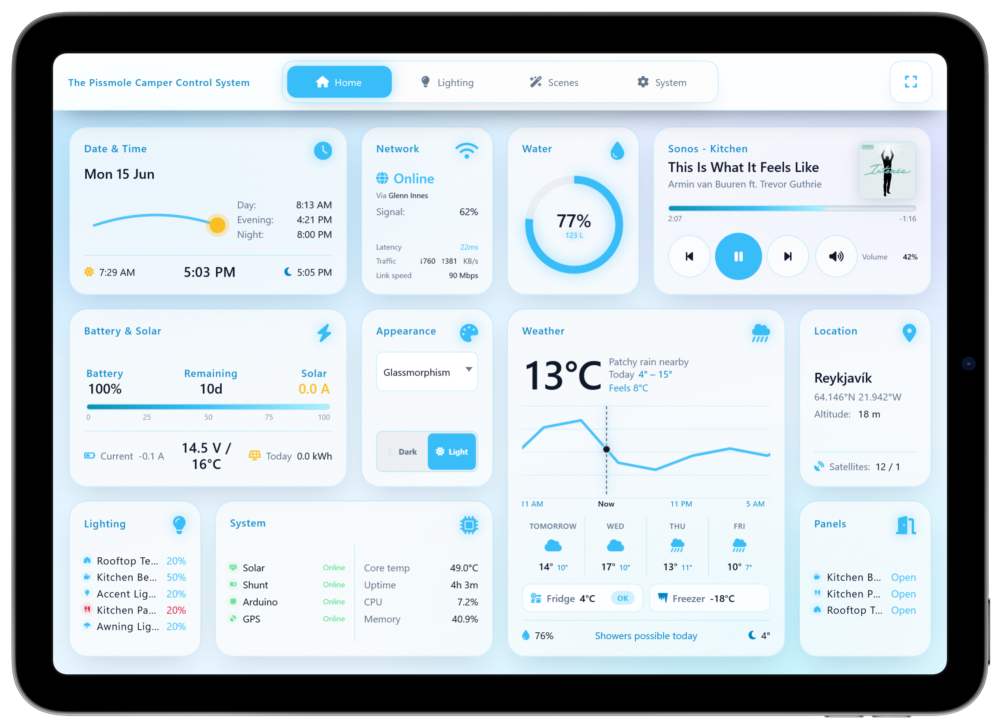
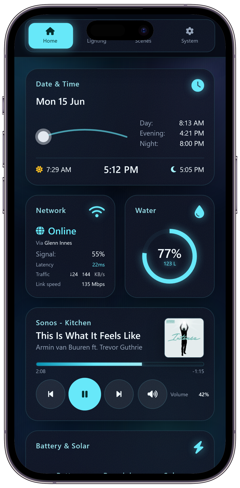

# The Pissmole Camper Control System

## Overview

The Pissmole Camping Control System (PCCS) is a Raspberry Pi-based control system for managing RV/camper trailer lighting and environmental data.

**Lighting and control**
-   Control of dimmable lighting and on/off relays
-   Swapping between white and red (anti-bug) modes for kitchen and awning lights
-   Lighting scenes such as bedtime, bathroom and all off
-   Time-of-day phase calculation (day, evening and night) and accurate sunset/sunrise times based on GPS derived co-ordinates
-   Reed switch monitoring of panel doors that switch on linked lights to levels based on time-of-day/phase
-   Ambient lighting such as accent and awning that turn on whenever any panel is open
-   Protection against turning on the rooftop tent lights when closed where the LED strip may be pressed against bedding
-   Comprehensive logging that shows what light turned on and what activated it (phase change, scene, reed, user interface etc.)
-   A flexible & scalable UI that can be accessed from any device including touchscreens, tablets and phones
-   Full support for Cloudflare Tunnels for if the Internet connection is behind cgnat (e.g. Starlink, hotspots)
-   A toast/message popup system with helpful information when events happen like GPS fix acquired/lost and phase changes
-   Modern UI themes with light/dark modes including Glassmorphism/Frosted Glass, Neumorphism, Deep Minimal/Stealth and automatic toggling of light and dark modes in the evening and morning
-   A diagnostics and settings page with extensive override controls and additional information

**Environmental data**

- GPS location, time, and sunrise/sunset from current coordinates
- Water tank level
- Temperature and daily min/max weather forecasts for the current location
- GPS fix quality and nearest suburb (offline fallback for north-east Victoria, Australia)
- Battery and solar via Victron SmartShunt and MPPT SmartSolar

The PCCS provides a better glamping experience when installed alongside other RPI packages:

- NAT and DHCP via dnsmasq; upstream via USB tethering, 5G modem, or Starlink
- UniFi controller for UniFi WAPs
- Pi-hole for ad blocking

---

## Hardware

### Backend

Built for:

- Raspberry Pi
- Arduino Mega 2560 and IRLZ44N MOSFETs for LED PWM and analog water tank level
- Adafruit Ultimate GPS Breakout PA1616S
- 4-channel 5 VDC relay module
- DS18B20 1-Wire temperature sensor
- Fuel level sensor that scales from 240ohm (full) to 33ohm (empty) for the water tanks
- Victron SmartShunt — battery voltage, current, SoC, time remaining, etc.
- Victron SmartSolar MPPT — solar power, daily yield, charge state

### Frontend

A Waveshare (or similar) touchscreen on a separate Raspberry Pi or Rock 5c board for heavier graphics.

### Other hardware

- USB Bluetooth dongle (required for Victron equipment). Onboard Bluetooth disabled so that the GPS can use the UART which is the same port the onboard Bluetooth uses
- 12–48 V PoE 5-port switch — WAP, PCCS, and wired touchscreens (e.g. kitchen, rooftop tent)
- Cel-Fi GO 4G/5G booster

---

## User interface

The UI runs on touchscreens, tablets, and phones. Red indicators mark bug-mode-capable lights.

| | |
|:---:|:---:|
|  |  |
| **Neumorphism (Dark)** | **Neumorphism (Light)** |
|  |  |
| **Glassmorphism (Dark)** | **Glassmorphism (Light)** |
|  |  |

### Additional themes

Nine alternate visual styles sit alongside the default Neumorphism and Glassmorphism looks. Pick any theme from the **System** page; each one respects the global light/dark appearance setting. Hover a preview to see the theme name.

| | | |
|:---:|:---:|:---:|
|  |  |  |
|  |  |  |
|  |  |  |

More examples in the [`/images`](images/) folder.

---

## Wiring

### Raspberry Pi

| Logical/BCM | Physical | Channel type | Description |
|:-----------:|:--------:|:-------------|:------------|
| GPIO4 | 7 | 1-Wire input | DS18B20 temperature sensor |
| GPIO8 | 24 | UART TX | GPS transmit |
| GPIO10 | 19 | UART RX | GPS receive |
| GPIO17 | 11 | Relay 1 | Floodlights |
| GPIO18 | 12 | Relay 2 | Future water circuit *(not currently in use)* |
| GPIO22 | 15 | Relay 3 | Future lighting circuit *(not currently in use)* |
| GPIO27 | 13 | Relay 4 | Future fridge and oven circuit *(not currently in use)* |
| GPIO12 | 32 | Reed input | Kitchen bench |
| GPIO23 | 16 | Reed input | Kitchen panel |
| GPIO24 | 18 | Reed input | Storage panel |
| GPIO25 | 22 | Reed input | Rear drawer |
| GPIO26 | 37 | Reed input | Rooftop tent |
| — | USB | Serial | Arduino Mega |
| — | USB | — | Bluetooth dongle |

**Notes**

- Enable 1-Wire in `raspi-config` during [installation](INSTALL.md#software-installation--configuration) (step 10).
- Victron equipment needs a USB Bluetooth dongle ([Victron setup](INSTALL.md#victron-setup)).
- 5 V for peripherals (GPS, relay module, etc.) is not shown in the table above.

### Arduino Mega

**Outputs**

| Pin | Channel type | Description |
|:---:|:-------------|:------------|
| 2 | PWM/output | Kitchen panel RGBW — white |
| 3 | PWM/output | Kitchen panel RGBW — red |
| 4 | PWM/output | Kitchen panel RGBW — green |
| 5 | PWM/output | Kitchen bench LED strip |
| 6 | PWM/output | Storage panel LED strip and downlights |
| 7 | PWM/output | Rear drawer LED strip |
| 8 | PWM/output | Accent LED strips |
| 9 | PWM/output | Awning RGBW — white |
| 10 | PWM/output | Awning RGBW — red |
| 11 | PWM/output | Awning RGBW — green |
| 12 | PWM/output | Rooftop tent LED strip |
| 13 | PWM/output | Ensuite tent LED strip |

**Inputs**

| Pin | Channel type | Description |
|:---:|:-------------|:------------|
| A1 | Analog input | Water tank sender |

**Notes**

- Arduino Mega is used because Pi PWM/I²C servo boards lack the drive strength for these MOSFET loads.
- A breadboard carrier for MOSFETs and field wiring is required.
- Some analog conditioning may still be needed for the water tank sender on A1.
- Blue RGB channels are unused (Arduino pin budget); green softens red bug mode.

---

## Installation

All software installation and configuration — OS imaging through systemd, Victron BLE, touchscreens, Samba, scripts, updates, NAT/DHCP, and UniFi — is documented in **[INSTALL.md](INSTALL.md)**.
